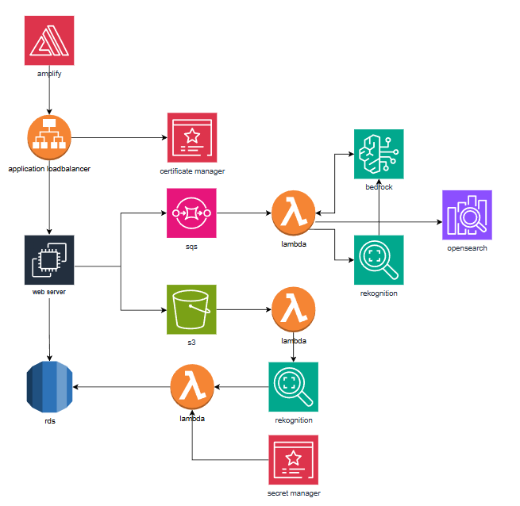

# 🏗️ Infrastructure & Architecture



## 1. Overview
**낭중지추(囊中之錐)** 프로젝트는 방대한 커뮤니티 게시글 중 사용자의 취향을 꿰뚫는 핵심 콘텐츠를 숏폼 형태로 제공하는 AI 기반 초개인화 큐레이션 플랫폼입니다.
안정적인 서비스 제공과 확장성을 위해 AWS 클라우드 환경을 기반으로 구축되었으며, **MSA(Microservices Architecture) 지향의 이벤트 기반 아키텍처**를 채택하여 백엔드 부하를 최소화했습니다.

## 2. System Architecture (Cloud Configuration)

전체 시스템은 AWS VPC 내에서 보안과 유연성을 고려하여 구성되었습니다.

### ☁️ AWS Cloud Resource
* **Compute**:
    * **EC2**: Django API 서버 및 Bastion Host 운영.
    * **Lambda**: 이미지 분석, 벡터 임베딩 생성 등 고비용 AI 작업을 서버리스로 처리.
* **Storage & Database**:
    * **S3**: 게시글 이미지 및 미디어 파일 저장 (미디어 서버 역할).
    * **RDS (PostgreSQL)**: 사용자 정보, 게시글 메타데이터 저장. `pgvector` 확장을 통해 추천 알고리즘 연산 지원.
    * **OpenSearch**: 1024차원 벡터 검색 엔진으로 시맨틱 검색 구현.
* **Networking & Security**:
    * **Domains**: `njjc.kro.kr` (Frontend), `api.njjc.kro.kr` (Backend) 분리 운영.
    * **SSL**: 각 도메인별 분리된 인증서 관리로 보안 강화.

---

## 3. Core Pipelines

### ⚡ Event-Driven Architecture (AI Processing)
사용자 경험을 저해하지 않으면서 고성능 AI 모델을 구동하기 위해 **SQS**와 **Lambda**를 활용한 비동기 파이프라인을 구축했습니다.

1.  **Semantic Search Pipeline**:
    * 사용자가 게시글 업로드 시 1024차원의 숫자 배열(Vector)로 변환.
    * **AWS Bedrock** & **OpenSearch** 연동을 통해 게시글의 문맥을 분석하고 검색 시 코사인 유사도가 가장 가까운 게시글을 추천.
2.  **Content Moderation Pipeline**:
    * 이미지 업로드 시 **S3 Event**가 트리거되어 **AWS Lambda** 실행.
    * **AWS Rekognition**이 이미지의 라벨을 반환하여 음란물/폭력물 여부 감지.
    * 유해 콘텐츠 식별 시 DB(`is_nsfw`, `is_profane`) 자동 업데이트 및 필터링.

### 🎯 Recommendation System Engine
사용자의 취향을 정밀하게 타격하기 위해 **하이브리드 추천 시스템**을 구현했습니다.

* **Algorithm Logic**:
    ```math
    Score = (UserPreference \times 0.4) + (Collaborative \times 0.4) + (Recency \times 0.2)
    ```
* **Vector Processing**:
    * **Content-Based**: SBERT 모델을 활용해 사용자 선호도를 768차원 벡터로 변환[cite: 109].
    * **Collaborative Filtering (CF)**: User-Interaction 행렬(User x Post) 구성 후, **SVD(특이값 분해)** 기법을 적용하여 64차원 잠재 요인(Latent Factor) 추출.
* **Real-time Update**:
    * **Django Signals**를 활용하여 댓글, 좋아요, 게시글 작성 등의 이벤트 발생 시 백그라운드에서 로그를 기록하고 임베딩 벡터를 즉시 업데이트.

---

## 4. Frontend & Monitoring

### 🎨 Client Side Optimization
* **Tech Stack**: Vue.js[cite: 176].
* **Icon Font Optimization**:
    * 개발 환경이나 빌드 시 사용되는 기능을 위해 **Vite 플러그인**을 직접 제작.
    * 전체 코드에서 사용된 아이콘 이름만 추출하여 필요한 폰트만 다운로드하도록 설계.
    * 결과: 폰트 리소스 크기 **3.6MB → 17KB**로 획기적 개선.

### 📊 Observability
* **Microsoft Clarity**: 모니터링 툴을 도입하여 행동 녹화 및 히트맵(Heatmap) 분석을 통해 프론트엔드 QA 및 사용자 경험 개선 진행.

---

## 5. Summary of Tech Stack

| Category | Technology | Usage |
| :--- | :--- | :--- |
| **Backend** | Python, Django | RESTful API Server |
| **Frontend** | Vue.js, Vite | Client Application |
| **Infra** | AWS EC2, S3, Amplify | Server & Hosting |
| **Serverless** | AWS Lambda, SQS | Event-driven AI Pipeline |
| **Database** | PostgreSQL, pgvector | RDBMS & Vector Operation |
| **Search** | OpenSearch | Semantic Search Engine |
| **AI/ML** | AWS Bedrock, Rekognition | Embedding & Image Analysis |

## 🔒 내부 OpenSearch 접속 방법 (SSH Tunneling)

보안을 위해 OpenSearch는 VPC 내부(`Private Subnet`)에 위치해 있습니다. 로컬 환경에서 OpenSearch 대시보드나 API에 접근하려면 Bastion Host를 통한 **SSH 터널링**이 필요합니다.

### 접속 명령어

아래 명령어를 터미널에 입력하면, 로컬의 `https://localhost:9200`으로 OpenSearch에 접근할 수 있습니다.

```bash
# 443 포트는 로컬에서 권한 문제가 있을 수 있어 9200 포트로 포워딩하는 것을 권장합니다.
ssh -i <YOUR_PEM_KEY_PATH> \
    -N -f -L 9200:<OPENSEARCH_ENDPOINT>:443 \
    ec2-user@<BASTION_HOST_IP>
```

* **YOUR_PEM_KEY_PATH**: EC2 접속용 프라이빗 키 파일 경로
* **OPENSEARCH_ENDPOINT**: AWS OpenSearch 도메인 엔드포인트 (VPC 내부 주소)
* **BASTION_HOST_IP**: Bastion EC2의 퍼블릭 IP

### 접속 확인
터널링이 연결된 상태에서 브라우저나 Postman으로 아래 주소에 접속하세요.
`https://localhost:9200`